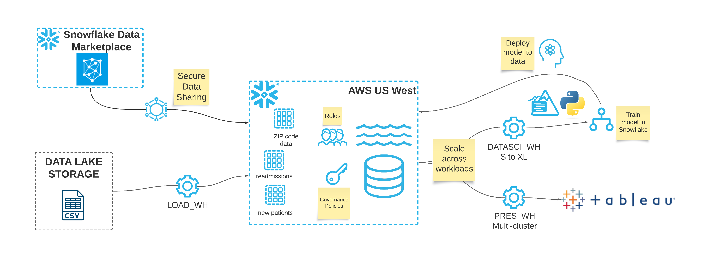

# Readmissions Demo

This demo is based on some synthesized data consisting of of attributes for providers, patients, and the patient's inpatient stay. We will build a model on historical data to predict whether or not a patient will be readmitted to the hospital within the next 30 days. 

### Vignette 1: Import, prepare, and enrich data
In the first vignette we import our data and enrich it with zip-code level data from the Snowflake Marketplace. Once our first-party data is enriched it is ready for modeling.

Capabilities and concepts: worksheet context, stages, SnowSQL, file formats, copy data into table, secure data sharing via Marketplace

### Vignette 2: Feature engineering and predictive modeling with Snowpark for Python
In the second vignette we will use Snowpark for Python to further prepare the data for modeling by imputing missing values. We will use stored procedures and user defined functions to train a scikit-learn logistic regression model to predict readmission. Once we have our predictive model we will score new patients and prototype how we want to deliver our predictions in a visualization. 
 
Concepts and capabilities: Snowpark for Python, Snowpark dataframes and dataframe API, SPROC and UDF with custom Python logic in Anaconda sandbox, moving data from Snowflake to Python client, saving Snowpark dataframes as permanent Snowflake tables for reuse 

### Vignette 3: Predicting patients and preparation for outreach
Once we have predicted whether or not our new patients will be readmitted, we want to enable our outreach coordinators. In this vignette we will create a role for our outreach coordinator and grant them limited access to data and compute (MCW, to support concurrency for BI). We create governance policies that allow this limited outreach coordniator role to only see patients that have been predicted to be readmitted and columns relevant to their outreach. 

Concepts and capabilities: RBAC, isolated compute, multi-cluster warehouse for concurrency, row access policies, dynamic data masking, conditional masking

### Vignette 4: Dashboarding and reporting
The output of this analytics process will be a report for our outreach coordinators to leverage. Connect the Tableau workbook to your Snowflake account to leverage the data, roles, and compute. 

Concepts and capabilities: Pushing compute down to the data, query history to see the SQL executed by Tableau.
